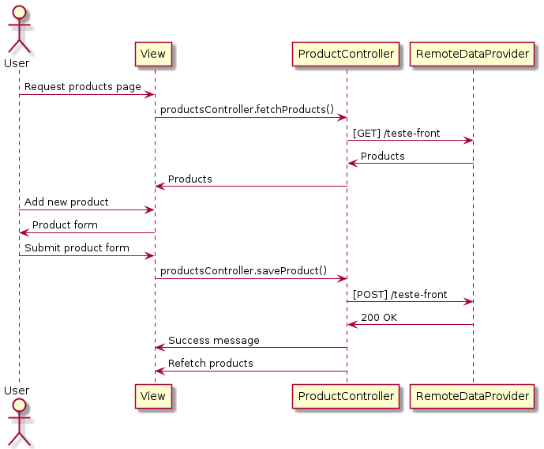

# Front-end Challenge

This project was created as part of a technical assessment and showcases an application developed using modern technologies and industry best practices for frontend development.
Check it out [here](https://frontend-challenge-psi-liart.vercel.app/)

## Technologies

- Framework: React.js
- UI Framework (Design System): Chakra UI
- End-to-End Testing: Cypress
- Containerization: Docker
- Cloud Environment: Vercel

## Installation

To run the project locally, follow these steps:

- Clone the repository:

```sh
git clone https://github.com/edfepinto/frontend-challenge
```

- Install the required Node.js version:

```sh
nvm install
nvm use
```

- Install dependencies and start the development server:

```sh
npm install
npm run dev
```

The application will be available at http://localhost:5173

## Design Patterns

This project incorporates various design patterns, including elements from the Clean Architecture, and follows a "Screaming Architecture Design" approach. The most prominently used design patterns are the Factory pattern and the Inversion of Dependency principle from SOLID.

### Factory

The Factory pattern is utilized to create product page components from generic components. This approach allows for greater flexibility and a more scoped component structure.

Example of usage with the generic filter component:

```js
function ProductsFilter() {
  const filterFields = [
    {
      name: "name",
      label: "Nome",
    },
    {
      name: "reference",
      label: "Referência",
    },
    {
      name: "manufacturer",
      label: "Fabricante",
    },
  ];

  return (
    <Filter
      filterFields={filterFields}
      onFilterChange={onFilterChange}
      onFilterReset={onFilterReset}
    />
  );
}
```

## End-to-End Testing

Automated tests are implemented using Cypress. Below is a demonstration of Cypress in action:


To run the tests:

```sh
npm run cypress:open
```

## Dockerization

For production deployment, the application can be containerized using Docker. To build a production image with Nginx as the web server, run:

```sh
docker build -t frontend_challenge:1.0 .
```

Then, to run the image:

```sh
docker run -p 80000:80 frontend_challenge:1.0
```

## UML Diagrams for Modeling and Documentation

PlantUML is used to create UML diagrams as code. Here's an example of a sequence diagram that depicts the flow of a user creating a new product:



## Conclusion and possible improvements

This project successfully demonstrates frontend development skills and accomplishes its primary objective. However, given more time, the following improvements could be made:

- Creation of a generic form component to enhance reusability.
- Comprehensive E2E testing covering all application features.
- Isolation of components for desktop and mobile layouts.
- Implementation of atomic design principles for better component organization.
- Adoption of Storybook for component documentation and showcase.

## References

- Design patterns: https://refactoring.guru
- Architecture: https://herbertograca.com/2017/11/16/explicit-architecture-01-ddd-hexagonal-onion-clean-cqrs-how-i-put-it-all-together/
